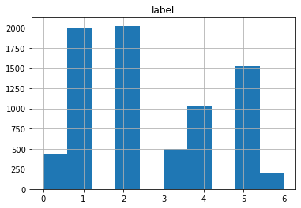
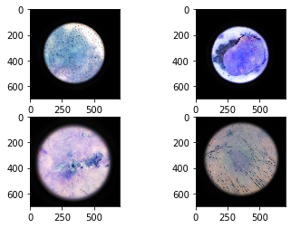
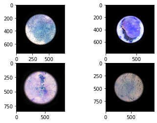
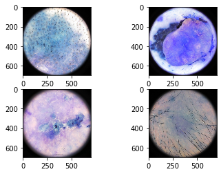
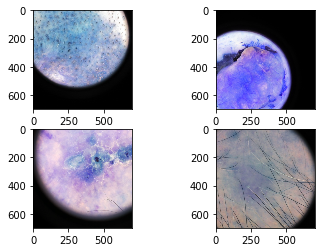
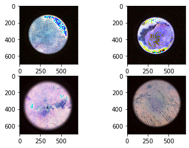

# MLWARE 1st PLACE SOLUTION!

During this compeitition the task was to classify various skin cancer images in one of the seven categories.

## EDA

We performed EDA to check the distribution of the data by plotting various curves.


```python
import pandas as pd
import numpy as np
import matplotlib.pyplot as plt
```


```python
df=pd.read_csv('data/train.csv')
dt=pd.read_csv('data/sample_submission.csv')
```


```python
print("Missing Values")
print(df.isna().sum())
```

    Missing Values
    image    0
    label    0
    dtype: int64
    

No missing labels were found in the data!

The distribution histogram for train data is as follows:-


```python
print(pd.value_counts(df['label']))
df.hist()
```

    2    2026
    1    1991
    5    1522
    4    1025
    3     493
    0     442
    6     197
    Name: label, dtype: int64
    


    array([[<matplotlib.axes._subplots.AxesSubplot object at 0x00000188F4DB0608>]],
          dtype=object)





## Augmentations

The following augmentations were applied in our approach:-

Applying random rotations to each of the images.


```python
import cv2
from scipy import ndimage
imgs=[cv2.imread('data/data_images/train/train{}.jpg'.format(i)) for i in [2,26,51,57]]
rotated_images=[ndimage.rotate(img, np.random.random()*180) for img in imgs]
f, axarr = plt.subplots(2,2)
axarr[0,0].imshow(imgs[0])
axarr[0,1].imshow(imgs[1])
axarr[1,0].imshow(imgs[2])
axarr[1,1].imshow(imgs[3])
f, axarr = plt.subplots(2,2)
axarr[0,0].imshow(rotated_images[0])
axarr[0,1].imshow(rotated_images[1])
axarr[1,0].imshow(rotated_images[2])
axarr[1,1].imshow(rotated_images[3])
```


    <matplotlib.image.AxesImage at 0x188f77d4d88>








Applying bounding rectangle to each image as some of the images have very less ROI(rest as black).


```python
import cv2
f, axarr = plt.subplots(2,2)
axarr[0,0].imshow(imgs[0])
axarr[0,1].imshow(imgs[1])
axarr[1,0].imshow(imgs[2])
axarr[1,1].imshow(imgs[3])
```


    <matplotlib.image.AxesImage at 0x188f9155d48>


```python
def crop_and_resize_images(imgs, resize_size = 700):
    cropped_imgs = []
    for image in imgs:
        img = cv2.cvtColor(image, cv2.COLOR_BGR2GRAY)
        _, thresh = cv2.threshold(img, 30, 255, cv2.THRESH_OTSU)
        contours, _ = cv2.findContours(thresh,cv2.RETR_LIST,cv2.CHAIN_APPROX_SIMPLE)[-2:]
        idx = 0 
        ls_xmin = []
        ls_ymin = []
        ls_xmax = []
        ls_ymax = []
        for cnt in contours:
            idx += 1
            x,y,w,h = cv2.boundingRect(cnt)
            ls_xmin.append(x)
            ls_ymin.append(y)
            ls_xmax.append(x + w)
            ls_ymax.append(y + h)
        xmin = min(ls_xmin)
        ymin = min(ls_ymin)
        xmax = max(ls_xmax)
        ymax = max(ls_ymax)
        roi = image[ymin:ymax,xmin:xmax]
        resized_roi = cv2.resize(roi, (resize_size, resize_size))
        cropped_imgs.append(resized_roi)
    return cropped_imgs

f, axarr = plt.subplots(2,2)
cropped_imgs=crop_and_resize_images(imgs,700)
axarr[0,0].imshow(cropped_imgs[0])
axarr[0,1].imshow(cropped_imgs[1])
axarr[1,0].imshow(cropped_imgs[2])
axarr[1,1].imshow(cropped_imgs[3])
```


    <matplotlib.image.AxesImage at 0x188fa83b988>





Applying random crop to the images.


```python
def get_random_crop(image, crop_height=450, crop_width=450):
    max_x = image.shape[1] - crop_width
    max_y = image.shape[0] - crop_height
    x = np.random.randint(0, max_x)
    y = np.random.randint(0, max_y)
    crop = image[y: y + crop_height, x: x + crop_width]
    img=cv2.resize(crop,(700,700))
    return img
cropped=[get_random_crop(img) for img in imgs]
f, axarr = plt.subplots(2,2)
axarr[0,0].imshow(cropped[0])
axarr[0,1].imshow(cropped[1])
axarr[1,0].imshow(cropped[2])
axarr[1,1].imshow(cropped[3])
```


    <matplotlib.image.AxesImage at 0x188fbc20988>





Random noise addition in the images.


```python
def add_random_noise(imgs,max_std=30):
    noised=[]
    for img in imgs:
        img=img.astype('float32')
        img[:,:,0]+=np.random.random(img.shape[:-1])*np.random.random()*max_std
        img[:,:,1]+=np.random.random(img.shape[:-1])*np.random.random()*max_std
        img[:,:,2]+=np.random.random(img.shape[:-1])*np.random.random()*max_std
        img=img.astype('uint8')
        noised.append(img)
    return noised

noised_images=add_random_noise(imgs)
f, axarr = plt.subplots(2,2)
axarr[0,0].imshow(noised_images[0])
axarr[0,1].imshow(noised_images[1])
axarr[1,0].imshow(noised_images[2])
axarr[1,1].imshow(noised_images[3])
```


    <matplotlib.image.AxesImage at 0x188fc32ed88>





Apply Cutmix augmentation for the dataset.


```python
import numpy as np
import random
from torch.utils.data.dataset import Dataset


class CutMix(Dataset):
    def __init__(self, dataset, num_classes, num_mix=1, beta=1., prob=1.0):
        self.dataset = dataset
        self.num_classes = num_classes
        self.num_mix = num_mix
        self.beta = beta
        self.prob = prob

    def __getitem__(self, index):
        img, lb = self.dataset[index]
        lb_onehot = [onehot(self.num_classes[i], lb[i]) for i in range(len(self.num_classes))]

        for _ in range(self.num_mix):
            r = np.random.rand(1)
            if self.beta <= 0 or r > self.prob:
                continue

            # generate mixed sample
            lam = np.random.beta(self.beta, self.beta)
            rand_index = random.choice(range(len(self)))

            img2, lb2 = self.dataset[rand_index]
            lb2_onehot = [onehot(self.num_classes[i], lb2[i]) for i in range(len(self.num_classes))]

            bbx1, bby1, bbx2, bby2 = rand_bbox(img.size(), lam)
            img[:, bbx1:bbx2, bby1:bby2] = img2[:, bbx1:bbx2, bby1:bby2]
            lam = 1 - ((bbx2 - bbx1) * (bby2 - bby1) / (img.size()[-1] * img.size()[-2]))
            for i in range(len(lb_onehot)):
                lb_onehot[i] = lb_onehot[i] * lam + lb2_onehot[i] * (1. - lam)

        return img, lb_onehot

    def __len__(self):
        return len(self.dataset)


def onehot(size, target):
    vec = torch.zeros(size, dtype=torch.float32)
    vec[target] = 1.
    return vec


def rand_bbox(size, lam):
    if len(size) == 4:
        W = size[2]
        H = size[3]
    elif len(size) == 3:
        W = size[1]
        H = size[2]
    else:
        raise Exception

    cut_rat = np.sqrt(1. - lam)
    cut_w = np.int(W * cut_rat)
    cut_h = np.int(H * cut_rat)

    # uniform
    cx = np.random.randint(W)
    cy = np.random.randint(H)

    bbx1 = np.clip(cx - cut_w // 2, 0, W)
    bby1 = np.clip(cy - cut_h // 2, 0, H)
    bbx2 = np.clip(cx + cut_w // 2, 0, W)
    bby2 = np.clip(cy + cut_h // 2, 0, H)

    return bbx1, bby1, bbx2, bby2

```

# Models

Our approach includes trying several different models iteratively. Some of which are described below:-


```python
import torch
import torch.nn.functional as F
from torchvision import models
import pretrainedmodels
from efficientnet_pytorch import EfficientNet
```

Resnet-50


```python
class Resnet_50(torch.nn.Module):
    
    def __init__(self):
        super().__init__()
        model=models.resnet50(pretrained='imagenet')
        self.layer1=model.conv1
        self.layer2=model.bn1
        self.layer3=model.relu
        self.layer4=model.maxpool
        self.layer5=model.layer1
        self.layer6=model.layer2
        self.layer7=model.layer3
        self.layer8=model.layer4
        self.layer9=model.avgpool
        self.fc1=torch.nn.Linear(2048,7)
    def forward(self,x):
        x=self.layer1(x)
        x=self.layer2(x)
        x=self.layer3(x)
        x=self.layer4(x)
        x=self.layer5(x)
        x=self.layer6(x)
        x=self.layer7(x)
        x=self.layer8(x)
        x=self.layer9(x)
        x=torch.flatten(x,1)
        x=self.fc1(x)
        return x
```

Resnet-101


```python
class Resnet_101(torch.nn.Module):
    
    def __init__(self):
        super().__init__()
        model=models.resnet101(pretrained='imagenet')
        self.layer1=model.conv1
        self.layer2=model.bn1
        self.layer3=model.relu
        self.layer4=model.maxpool
        self.layer5=model.layer1
        self.layer6=model.layer2
        self.layer7=model.layer3
        self.layer8=model.layer4
        self.layer9=model.avgpool
        self.fc1=torch.nn.Linear(2048,7)
    def forward(self,x):
        x=self.layer1(x)
        x=self.layer2(x)
        x=self.layer3(x)
        x=self.layer4(x)
        x=self.layer5(x)
        x=self.layer6(x)
        x=self.layer7(x)
        x=self.layer8(x)
        x=self.layer9(x)
        x=torch.flatten(x,1)
        x=self.fc1(x)
        return x
```

Resnet-152


```python
class Resnet_152(torch.nn.Module):
    
    def __init__(self):
        super().__init__()
        model=models.resnet152(pretrained='imagenet')
        self.layer1=model.conv1
        self.layer2=model.bn1
        self.layer3=model.relu
        self.layer4=model.maxpool
        self.layer5=model.layer1
        self.layer6=model.layer2
        self.layer7=model.layer3
        self.layer8=model.layer4
        self.layer9=model.avgpool
        self.fc1=torch.nn.Linear(2048,7)
    def forward(self,x):
        x=self.layer1(x)
        x=self.layer2(x)
        x=self.layer3(x)
        x=self.layer4(x)
        x=self.layer5(x)
        x=self.layer6(x)
        x=self.layer7(x)
        x=self.layer8(x)
        x=self.layer9(x)
        x=torch.flatten(x,1)
        x=self.fc1(x)
        return x
```

Densenet-121


```python
class Densenet_121(torch.nn.Module):
    
    def __init__(self):
        model=models.densenet121(pretrained='imagenet')
        self.layer1=model.features
        self.fc1=torch.nn.Linear(1024,7)
        
    def forward(self,x):
        x=self.layer1(x)
        x=torch.fllatten(x,1)
        x=self.fc1(x)
        return x
```

Densenet-169


```python
class Densenet_169(torch.nn.Module):
    
    def __init__(self):
        model=models.densenet169(pretrained='imagenet')
        self.layer1=model.features
        self.fc1=torch.nn.Linear(1024,7)
        
    def forward(self,x):
        x=self.layer1(x)
        x=torch.fllatten(x,1)
        x=self.fc1(x)
        return x
```

Densenet-201


```python
class Densenet_201(torch.nn.Module):
    
    def __init__(self):
        model=models.densenet201(pretrained='imagenet')
        self.layer1=model.features
        self.fc1=torch.nn.Linear(1024,7)
        
    def forward(self,x):
        x=self.layer1(x)
        x=torch.fllatten(x,1)
        x=self.fc1(x)
        return x
```

Efficientnet-b0


```python
class Efficientnet_b0(torch.nn.Module):
    
    def __init__(self):
        super().__init__()
        model=EfficientNet.from_name('efficientnet-b0')
        self.layer1=model._conv_stem
        self.layer2=model._bn0
        self.layer3=model._blocks
        self.layer4=model._conv_head
        self.layer5=model._bn1
        self.layer6=model._avg_pooling
        self.layer7=model._dropout
        self.layer8=torch.nn.Linear(1280,7)
        self.layer9=model._swish
        
    
    def forward(self,x):
        x=self.layer1(x)
        x=self.layer2(x)
        for layer in self.layer3:
            x=layer(x)
        x=self.layer4(x)
        x=self.layer5(x)
        x=self.layer6(x)
        x=self.layer7(x)
        x=torch.flatten(x,1)
        x=self.layer8(x)
        x=self.layer9(x)
        return x
```

Efficientnet-b1


```python
class Efficientnet_b1(torch.nn.Module):
    
    def __init__(self):
        super().__init__()
        model=EfficientNet.from_name('efficientnet-b1')
        self.layer1=model._conv_stem
        self.layer2=model._bn0
        self.layer3=model._blocks
        self.layer4=model._conv_head
        self.layer5=model._bn1
        self.layer6=model._avg_pooling
        self.layer7=model._dropout
        self.layer8=torch.nn.Linear(1280,7)
        self.layer9=model._swish
        
    
    def forward(self,x):
        x=self.layer1(x)
        x=self.layer2(x)
        for layer in self.layer3:
            x=layer(x)
        x=self.layer4(x)
        x=self.layer5(x)
        x=self.layer6(x)
        x=self.layer7(x)
        x=torch.flatten(x,1)
        x=self.layer8(x)
        x=self.layer9(x)
        return x
```

Efficientnet-b2


```python
class Efficientnet_b2(torch.nn.Module):
    
    def __init__(self):
        super().__init__()
        model=EfficientNet.from_name('efficientnet-b2')
        self.layer1=model._conv_stem
        self.layer2=model._bn0
        self.layer3=model._blocks
        self.layer4=model._conv_head
        self.layer5=model._bn1
        self.layer6=model._avg_pooling
        self.layer7=model._dropout
        self.layer8=torch.nn.Linear(1280,7)
        self.layer9=model._swish
        
    
    def forward(self,x):
        x=self.layer1(x)
        x=self.layer2(x)
        for layer in self.layer3:
            x=layer(x)
        x=self.layer4(x)
        x=self.layer5(x)
        x=self.layer6(x)
        x=self.layer7(x)
        x=torch.flatten(x,1)
        x=self.layer8(x)
        x=self.layer9(x)
        return x
```

Efficientnet-b3


```python
class Efficientnet_b2(torch.nn.Module):
    
    def __init__(self):
        super().__init__()
        model=EfficientNet.from_name('efficientnet-b3')
        self.layer1=model._conv_stem
        self.layer2=model._bn0
        self.layer3=model._blocks
        self.layer4=model._conv_head
        self.layer5=model._bn1
        self.layer6=model._avg_pooling
        self.layer7=model._dropout
        self.layer8=torch.nn.Linear(1280,7)
        self.layer9=model._swish
        
    
    def forward(self,x):
        x=self.layer1(x)
        x=self.layer2(x)
        for layer in self.layer3:
            x=layer(x)
        x=self.layer4(x)
        x=self.layer5(x)
        x=self.layer6(x)
        x=self.layer7(x)
        x=torch.flatten(x,1)
        x=self.layer8(x)
        x=self.layer9(x)
        return x
```

Seresnet-50


```python
class seresnet_50(torch.nn.Module):

    def __init__(self):
        super().__init__()
        se_resnet50 = pretrainedmodels.se_resnet50(pretrained=None)
        self.layer0 = se_resnet50.layer0
        self.layer1 = se_resnet50.layer1
        self.layer2 = se_resnet50.layer2
        self.layer3 = se_resnet50.layer3
        self.layer4 = se_resnet50.layer4
        self.layer5 = torch.nn.Conv2d(2048, 256, (3, 3))
        self.fc1 = torch.nn.Linear(4096, 7)

    def forward(self, x):
        x = self.layer0(x)
        x = self.layer1(x)
        x = self.layer2(x)
        x = self.layer3(x)
        x = self.layer4(x)
        x = self.layer5(x)
        x = F.adaptive_avg_pool2d(x, (4, 4))
        x = torch.flatten(x, 1)
        x = self.fc1(x)
        return x
```

Seresnext-50 32x4d


```python
class seresnext_50_32x4d(torch.nn.Module):

    def __init__(self):
        super().__init__()
        se_resnet50 = pretrainedmodels.se_resnext50_32x4d(pretrained=None)
        self.layer0 = se_resnet50.layer0
        self.layer1 = se_resnet50.layer1
        self.layer2 = se_resnet50.layer2
        self.layer3 = se_resnet50.layer3
        self.layer4 = se_resnet50.layer4
        self.layer5 = torch.nn.Conv2d(2048, 256, (3, 3))
        self.fc1 = torch.nn.Linear(4096, 7)

    def forward(self, x):
        x = self.layer0(x)
        x = self.layer1(x)
        x = self.layer2(x)
        x = self.layer3(x)
        x = self.layer4(x)
        x = self.layer5(x)
        x = F.adaptive_avg_pool2d(x, (4, 4))
        x = torch.flatten(x, 1)
        x = self.fc1(x)
        return x
```

# Postprocessing

After training various models which are described above after appying various augmentations, we applied some further techniques
to increase the metric as described below:-

1. Pseudo-labelling: In this technique, we predicted labels on test data and fed the test data into the model using predicted labels as output and trained the model further. After every epoch, we tested the model and updated the labels and trained again.<br>

2. Test-time augmentation: In this technique, we used the above mentioned augmentations(except cutmix) to make about 15 augmentated images per original image(total 16 images). All the images are fed through models and majority voting is applied the various outputs of each model.<br>

3. Schostic Weight Averaging (SWA): In this technique, we averaged the weights for each layer in every model for the whole training cycle.<br>

4. Ensembling: In this technique, we used majority voting after testing and calculating final labels for each model.After this step, we saved and submitted the labels on compeitition submissions page.


